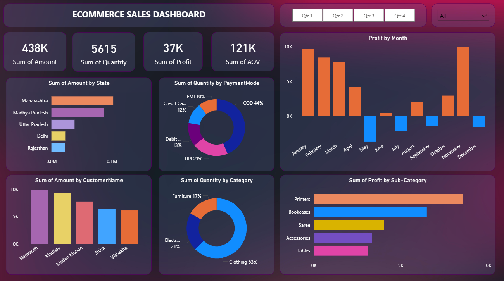

# 🛒 Ecommerce Sales Dashboard | Power BI Project

  

## 📌 Project Overview

This project focuses on building an **interactive Ecommerce Sales Dashboard using Power BI** to analyze online sales performance across states, customers, categories, and time periods.

The dashboard enables business stakeholders to monitor revenue, profit, quantity sold, and customer behavior using dynamic filters and drill-down capabilities.

---

## 🎯 Business Objective

- Track overall sales performance
- Analyze profitability trends
- Identify top-performing states and customers
- Understand category and sub-category performance
- Monitor monthly profit fluctuations
- Enable data-driven decision making

---

## 🛠️ Tools & Technologies Used

- **Power BI Desktop**
- Power Query (Data Transformation)
- Data Modeling (Relationships)
- DAX (Data Analysis Expressions)
- Slicers & Drill-down features
- Interactive Visualizations

---

## 📊 Key KPIs

- 💰 **Total Sales Amount:** 438K  
- 📦 **Total Quantity Sold:** 5615  
- 📈 **Total Profit:** 37K  
- 🧾 **Average Order Value (AOV):** 121K  

---

## 📈 Dashboard Features

### 1️⃣ Sales Overview
- Total Sales, Quantity, Profit & AOV KPI Cards
- Quarter-wise filtering (Q1, Q2, Q3, Q4)
- Dynamic filters using slicers

### 2️⃣ Geographic Analysis
- Sales distribution by State
- Top performing states:
  - Maharashtra
  - Madhya Pradesh
  - Uttar Pradesh
  - Delhi
  - Rajasthan

### 3️⃣ Payment Mode Analysis
- Quantity split by:
  - COD (44%)
  - UPI (21%)
  - Debit Card
  - Credit Card
  - EMI

### 4️⃣ Profit Trend Analysis
- Monthly profit visualization
- Identification of loss months
- Seasonal performance insights

### 5️⃣ Customer Analysis
- Top customers by sales amount
- Revenue contribution tracking

### 6️⃣ Category & Sub-Category Insights
- Quantity distribution by category (Clothing, Electronics, Furniture)
- Profit by sub-category (Printers, Bookcases, Saree, Accessories, Tables)

---

## 🔄 Project Workflow

1. Data Collection
2. Data Cleaning & Transformation using Power Query
3. Data Modeling & Relationship Creation
4. DAX Measures Creation (Sales, Profit, AOV, etc.)
5. Interactive Dashboard Design
6. Insight Generation & Optimization

---

## 🧠 Key Learnings

- Created an interactive dashboard to track and analyze ecommerce sales data
- Used complex parameters for drill-down and customization
- Implemented filters and slicers for dynamic analysis
- Created relationships and joined multiple tables
- Built DAX calculations to manipulate data and enable user-driven parameters
- Designed multiple customized visualizations:
  - Bar Charts
  - Donut Charts
  - Clustered Bar Charts
  - Line Charts
  - Area Charts
  - Scatter Charts
  - Map Visuals
  - Slicers

---

## 💡 Insights Generated

- COD is the most preferred payment method
- Clothing contributes the highest quantity sold
- Printers generate the highest profit among sub-categories
- Certain months show negative profit trends
- Maharashtra contributes the highest sales volume

---

## 🚀 Future Improvements

- Add Year-over-Year comparison
- Add Customer Segmentation (RFM Analysis)
- Add Forecasting using Power BI analytics
- Build a mobile-optimized version

---

## 👨‍💻 Author

Puja Kumari  
(Data Analytics Enthusiast)

---

⭐ If you found this project useful, feel free to star the repository!
